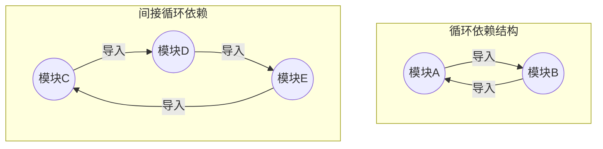
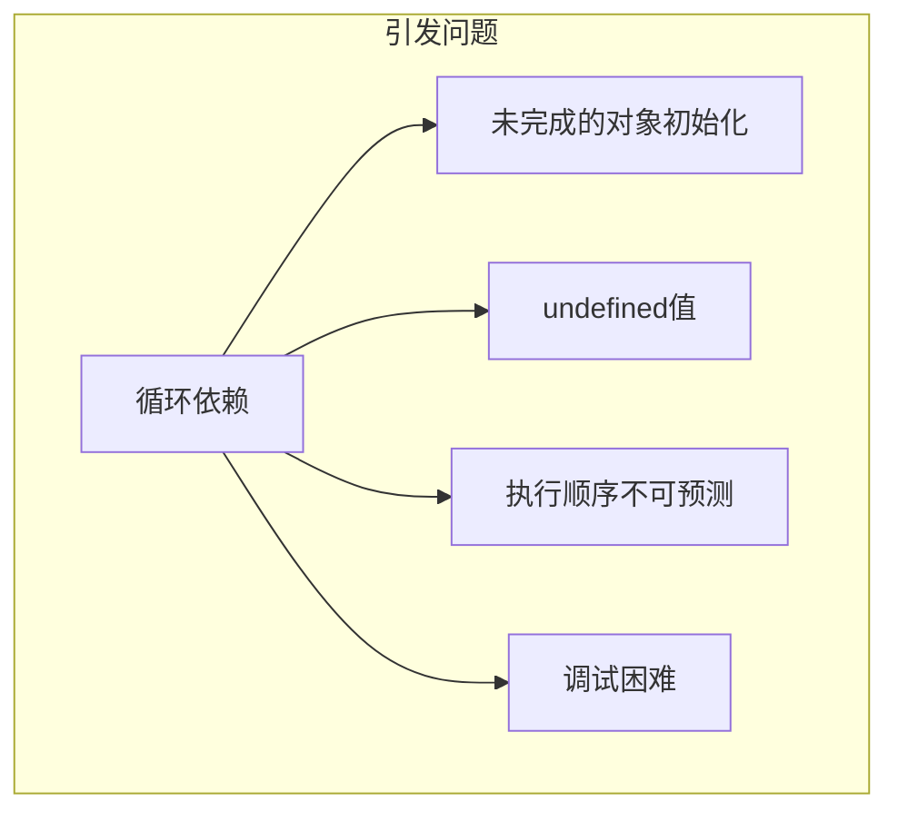
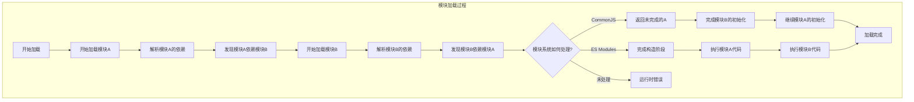

# 是什么

循环依赖(Circular dependency)是指在模块系统中，两个或多个模块形成相互引用的依赖关系。这种情况会导致模块加载和初始化过程变得复杂且难以预测。

### 循环依赖示例
如下图所示，循环依赖可以是直接的相互引用，也可以是间接的依赖环：



### 循环依赖引发的常见问题



### 问题详解

1. **未完成的对象初始化**：模块在被完全初始化前就被引用，导致访问到不完整的对象
2. **undefined值**：尝试访问尚未定义的导出，导致运行时错误
3. **执行顺序不可预测**：不同的模块系统处理循环依赖的方式不同，造成代码行为难以预测
4. **调试困难**：错误堆栈跟踪混乱，难以定位问题根源

# 为什么？



# 如何解决？

| 方法 | 示例 | 说明 |
| --- | --- | --- |
| ✅ 延迟加载 | `require()` 写到函数内部 | 避免初始化阶段访问未定义 |
| ✅ 提取公共模块 | 建立 shared.js | A 和 B 不直接依赖彼此 |
| ✅ 重构依赖方向 | 抽象高层逻辑模块 | 减少相互耦合 |

# 实际案例分析

## 全国易捷工单退款的循环依赖问题

### 现象

当从工单列表进入工单详情时，导致页面展示空白。代码报错：

```jsx
hook.js:608 TypeError: _pages_cashRegister_ThirdPlatformService_SinopecCompService__WEBPACK_IMPORTED_MODULE_16__.SinopecCompService is not a constructor
    at ./src/pages/cashRegister/ThirdPlatformService/service.js (service.js:12:68)
    at __webpack_require__ (bootstrap:853:1)
    at fn (bootstrap:150:1)
    at ./src/class/cashRegister/GatheringInfo.js (42.js:725:107)
    at __webpack_require__ (bootstrap:853:1)
    at fn (bootstrap:150:1)
    at ./src/class/cashRegister/index.js (index.js:1:1)
    at __webpack_require__ (bootstrap:853:1)
    at fn (bootstrap:150:1)
    at ./src/pages/cashRegister/ThirdPlatformService/SinopecCompService.js (42.js:3437:78)
overrideMethod @ hook.js:608
s2.f6yc.comnull/:1 
```

### 定位过程

错误日志中关键信息：

`_pages_cashRegister_ThirdPlatformService_SinopecCompService__WEBPACK_IMPORTED_MODULE_16__.SinopecCompService is not a constructor`

报错位置在：

`at ./src/pages/cashRegister/ThirdPlatformService/service.js (service.js:12:68)`

相关代码：

```jsx
import {
  SinopecCompService
} from '@/pages/cashRegister/ThirdPlatformService/SinopecCompService'
import { ChinaSinopecCashPayService } from '@/pages/cashRegister/ThirdPlatformService/ChinaSinopecCashPayService'
import { ChinaSinopecService } from '@/pages/cashRegister/ThirdPlatformService/ChinaSinopecService'

const serviceList = [new SinopecService(), new MasterTooService(), new SinopecCompService(), new ChinaSinopecCashPayService(), new ChinaSinopecService()]
```

报错原因是SinopecCompService不是一个构造函数。我们尝试打印SinopecCompService：


报错信息表明`SinopecCompService`在被实例化时不是一个构造函数，实际上它在调用时是`undefined`。

### 调试过程

我们将断点打到SinopecCompService对象上面：


得到以下的堆栈，分析调用问题：

```jsx
./src/pages/cashRegister/ThirdPlatformService/service.js (service.js:13)
__webpack_require__ (bootstrap:853)
fn (bootstrap:150)
./src/class/cashRegister/GatheringInfo.js (42.js:725)
__webpack_require__ (bootstrap:853)
fn (bootstrap:150)
./src/class/cashRegister/index.js (index.js:1)
__webpack_require__ (bootstrap:853)
fn (bootstrap:150)
./src/pages/cashRegister/ThirdPlatformService/SinopecCompService.js (42.js:3437)
__webpack_require__ (bootstrap:853)
fn (bootstrap:150)
./node_modules/cache-loader/dist/cjs.js?!./node_modules/babel-loader/lib/index.js!./node_modules/cache-loader/dist/cjs.js?!./node_modules/vue-loader/lib/index.js?!./src/pages/newMaintain/pages/ViewDetail/index.vue?vue&type=script&lang=js& (NewMaintainDetailView.js:1028)
__webpack_require__ (bootstrap:853)
fn (bootstrap:150)
./src/pages/newMaintain/pages/ViewDetail/index.vue?vue&type=script&lang=js& (index.vue:1)
__webpack_require__ (bootstrap:853)
fn (bootstrap:150)
./src/pages/newMaintain/pages/ViewDetail/index.vue (index.vue:1)
__webpack_require__ (bootstrap:853)....
```

通过调用堆栈，分析出循环依赖路径：

1. 从`ViewDetail/index.vue`开始，导入了`SinopecCompService.js`
2. 然后`SinopecCompService.js`导入了`Payment`类`from '@/class/cashRegister'`
3. `class/cashRegister/index.js`中导出了`GatheringInfo`等模块

   ```jsx
   export { GatheringInfo } from './GatheringInfo'
   export { GatheringConfig } from './GatheringConfig'
   export { Payment } from './Payment'
   export { CzkCard } from './CzkCard'
   export { Coupon } from './Coupon'
   ```

4. `GatheringInfo.js`导入了`service.js`中的`hiddenPayment`

   ```jsx
   import { hiddenPayment } from '@/pages/cashRegister/ThirdPlatformService/service'
   ```

5. 最后`service.js`又导入了`SinopecCompService`，从而形成了循环依赖

分析过程如图：


### 解决方案

解决方法很简单：将原先从`ViewDetail/index.vue`开始导入`SinopecCompService.js`的逻辑移出去，打破循环依赖链。