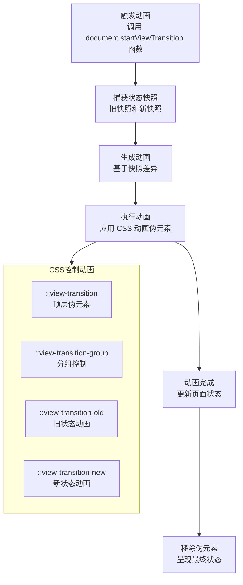

最近进行博客重构，因此参照了 [antfu](https://antfu.me/) 大神的博客的样式。

基本样式参照了其中，可是对于其中黑暗模式切换，被深深的吸引了，如下：


当时在想，这个是怎么做到的，为何次动画如此丝滑，我得研究下；


放弃了～～～

直接吧啦源码，看到如下关键信息：
```css
::view-transition-old(view-transition-name)
::view-transition-new(view-transition-name)
```

印象中，这段使用的是 **View Transition API** 中的内容；于是乎去翻阅各种文档；发现大佬这边文章 [页面级可视动画View Transitions API初体验](https://arc.net/l/quote/lnuwtrci)，大佬深入浅出详细说明了此 API 的作用以及使用；这里不做过多的说明；

> mark：View Transitions API 简化了复杂动画的实现，无需手动处理位置计算或动画控制，尤其适合页面级的场景切换和动画增强。

<div className="bg-default-300 rounded-small">

</div>
### 流程图说明

1. **触发动画**：用户通过调用 `document.startViewTransition()` 开始动画。
2. **捕获状态快照**：浏览器在 DOM 更新前后分别捕获旧状态和新状态。
3. **生成动画**：浏览器对比新旧快照的差异，生成过渡动画。
4. **执行动画**：根据 CSS 控制动画的伪元素定义的规则执行动画。
5. **动画完成**：动画结束后更新页面状态。
6. **移除伪元素**：动画伪元素被移除，最终状态呈现。

## 如何扩散

从上图显示效果而言，扩散是从一个点扩散到浏览器整体视窗；而视窗的最大半径我们可以通过鼠标点击或者 touch 事件来触发获取元素的 [**`Element.getBoundingClientRect()`**](https://developer.mozilla.org/zh-CN/docs/Web/API/Element/getBoundingClientRect)：

```js
const rect = this.themeLabel?.getBoundingClientRect();
```

boundingClientRect 包含两个 x 和 y，代码当前相对于视窗相对位置，借用 MDN 图：


而此时我们需要计算由我们点击位置向外扩散圆的半径；如下图：


```js
const radius = Math.hypot(
  Math.max(x, innerWidth - x),
  Math.max(y, innerHeight - y)
);
```

- `Math.hypot` 计算直角三角形的斜边长度，确保动画覆盖整个视窗。
- `Math.max` 确定从触发点到视窗边缘的最远距离，确保动画从中心点覆盖整个页面。

### 关于 `innerWidth`

`innerWidth` 是一个只读属性，返回窗口的文档显示区的宽度（以像素为单位）。它包括滚动条的宽度（如果有）。在计算动画扩散半径时，我们使用 `innerWidth` 来确定从触发点到视窗边缘的最远距离。

接下来我们定义动画绘画路径：

```js
const clipPath = [
  `circle(0px at ${x}px ${y}px)`,
  `circle(${radius}px at ${x}px ${y}px)`,
];
```

- `clipPath` 是一个数组，表示动画的起始和结束状态：
  - 起始状态：半径为 0 的圆（即无显示）。
  - 结束状态：覆盖整个页面的圆（最大半径）。

### 创建动画

```javascript
await document.documentElement.animate(
  { clipPath: currentTheme === "dark" ? clipPath.reverse() : clipPath },
  {
    duration: 350,
    easing: "ease-out",
    pseudoElement:
      currentTheme === "dark"
        ? "::view-transition-old(root)"
        : "::view-transition-new(root)",
  }
).finished;
```

**动画执行效果**

1. **切换到深色模式**：
   - 动画从大圆过渡到小圆（反转 `clipPath`）。
   - 动画目标是 `::view-transition-new(root)`。
2. **切换到浅色模式**：
   - 动画从小圆过渡到大圆。
   - 动画目标是 `::view-transition-new(root)`。

结合上面的流程图，在 `view-transition` 之后，使用 `pseudoElement` 精细控制新旧主题之间的过渡。

最终代码如下：【本次使用的是 WebComponent 进行组件的抽取】

```typescript
<script>
import { themeAtom } from "~/store";

class ThemeSwitcher extends HTMLElement {
  private themeLabel: HTMLLabelElement | null = null;
  private themeInput: HTMLInputElement | null = null;

  constructor() {
    super();
    this.initTheme();
  }

  private getSystemTheme(): "light" | "dark" {
    return window.matchMedia("(prefers-color-scheme: dark)").matches
      ? "dark"
      : "light";
  }

  private initTheme(): "light" | "dark" {
    const localTheme = window.localStorage.getItem("theme");
    return localTheme === "auto"
      ? this.getSystemTheme()
      : (localTheme as "light" | "dark") || "light";
  }

  private updateTheme(theme: "light" | "dark"): void {
    document.documentElement.classList.toggle("dark", theme === "dark");
    document.documentElement.style.colorScheme = theme;
    document.documentElement.setAttribute("data-theme", theme);
    this.themeLabel?.classList.toggle("swap-active", theme === "light");
    themeAtom.set(theme);
  }

  private async animateThemeTransition(x: number, y: number): Promise<void> {
    const currentTheme = this.initTheme();
    const radius = Math.hypot(
      Math.max(x, innerWidth - x),
      Math.max(y, innerHeight - y)
    );

    const clipPath = [
      `circle(0px at ${x}px ${y}px)`,
      `circle(${radius}px at ${x}px ${y}px)`,
    ];

    try {
      await document.documentElement.animate(
        { clipPath: currentTheme === "dark" ? clipPath.reverse() : clipPath },
        {
          duration: 350,
          easing: "ease-out",
          pseudoElement:
            currentTheme === "dark"
              ? "::view-transition-old(root)"
              : "::view-transition-new(root)",
        }
      ).finished;
    } catch (error) {
      console.error("Animation failed:", error);
    }
  }

  connectedCallback(): void {
    this.themeLabel = this.querySelector("label");
    this.themeInput = this.querySelector("input");

    if (!this.themeLabel || !this.themeInput) {
      console.error("Required elements not found");
      return;
    }

    const currentTheme = this.initTheme();
    this.updateTheme(currentTheme);

    this.themeInput.addEventListener("click", async (event) => {
      const currentTheme = this.initTheme();
      const newTheme = currentTheme === "dark" ? "light" : "dark";

      try {
        const transition = document.startViewTransition(async () => {
          this.updateTheme(newTheme);
          window.localStorage.setItem("theme", newTheme);
        });

        await transition.ready;
        const rect = this.themeLabel?.getBoundingClientRect();
        if (rect) {
          await this.animateThemeTransition(rect.x, rect.y);
        }
      } catch (error) {
        console.error("Theme switch failed:", error);
        // 回退方案
        this.updateTheme(newTheme);
        window.localStorage.setItem("theme", newTheme);
      }
    });
  }

  disconnectedCallback(): void {
    this.themeInput?.removeEventListener("click", () => {});
  }
}

customElements.define("switch-theme", ThemeSwitcher);
</script>
